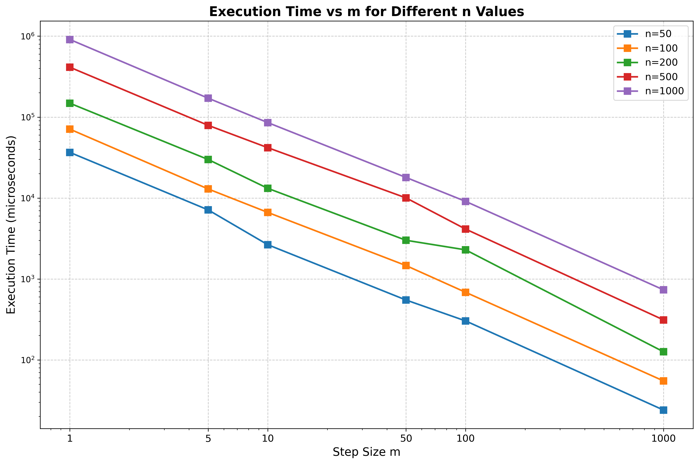
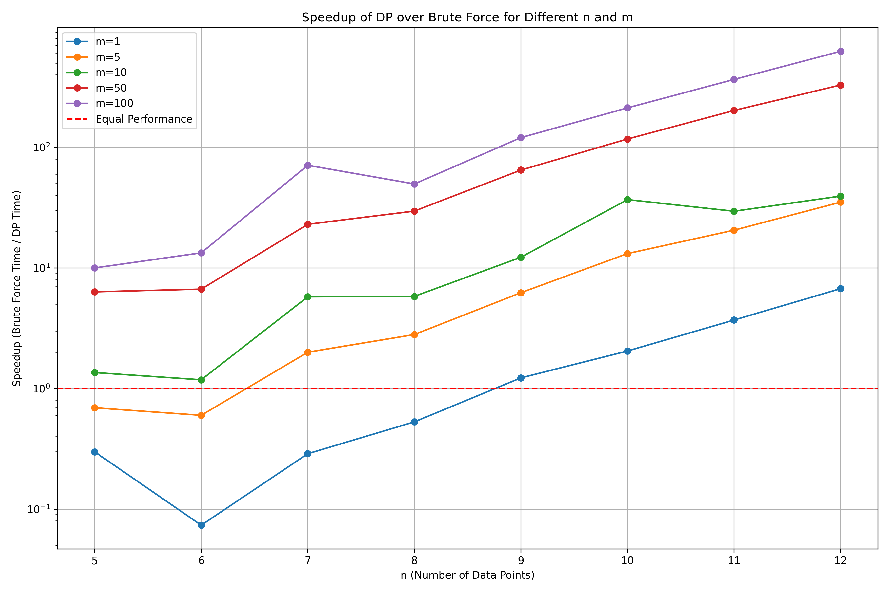
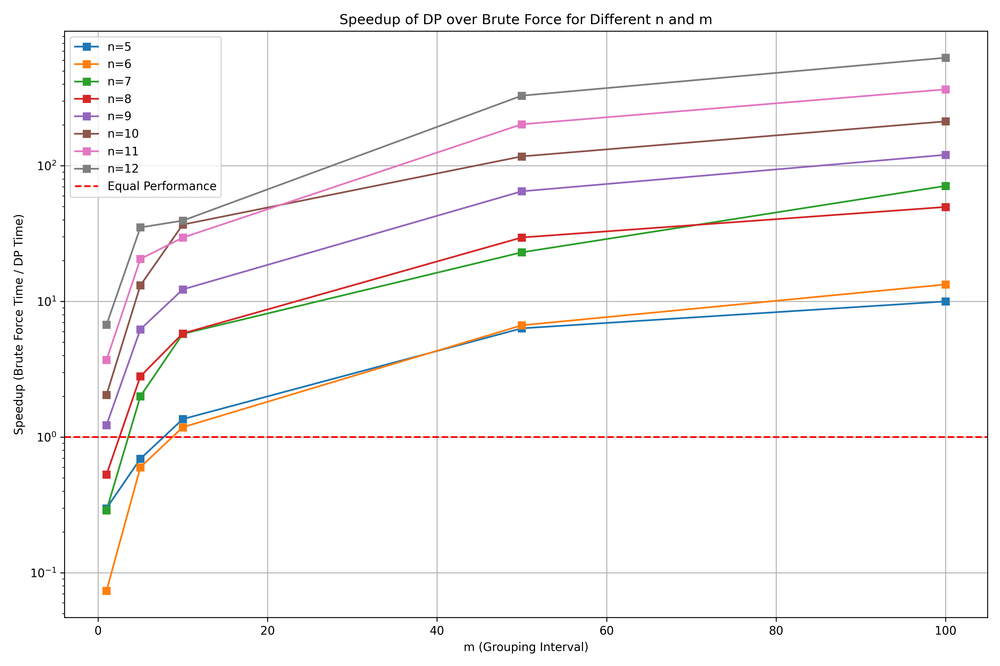
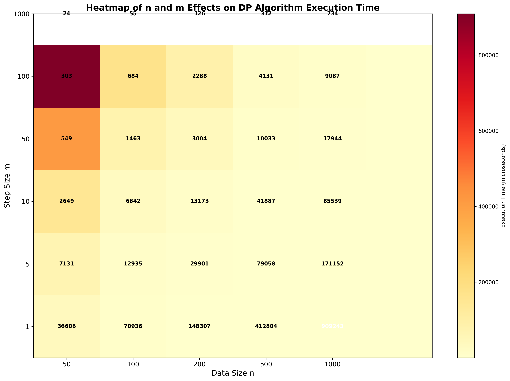
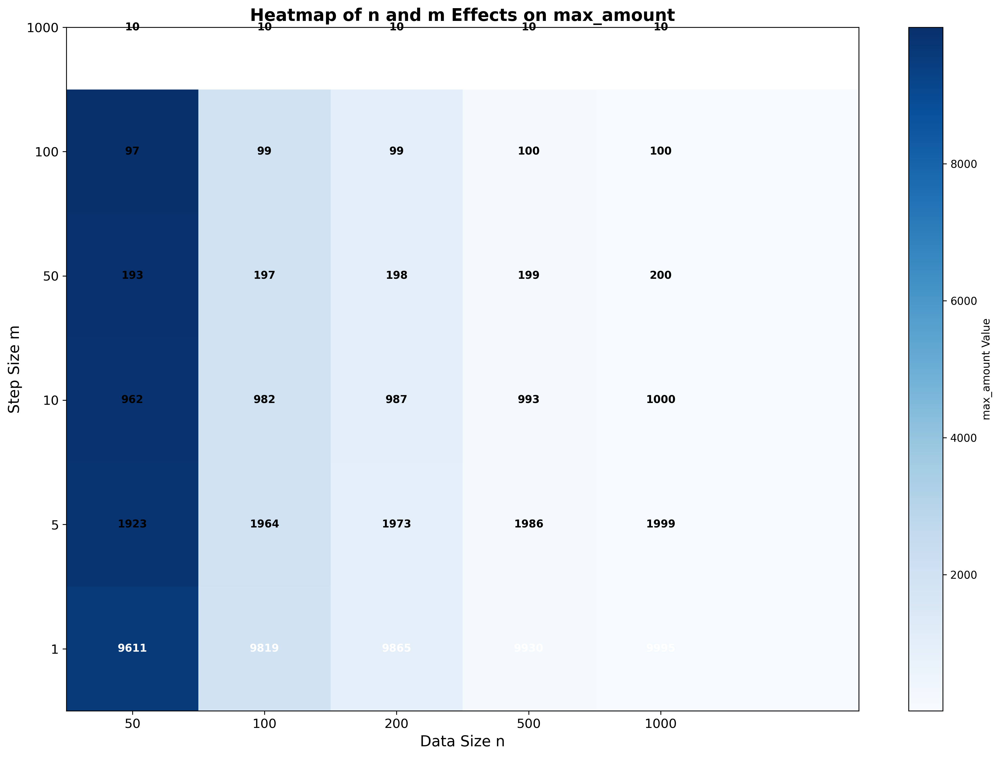
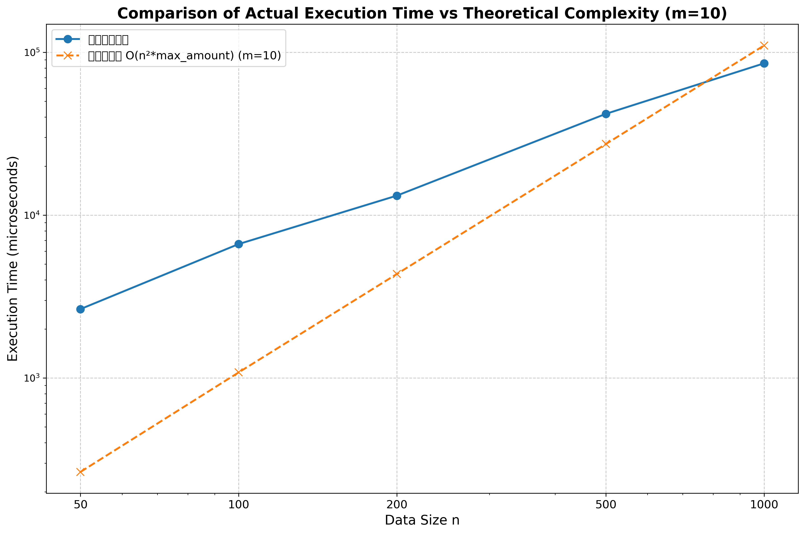
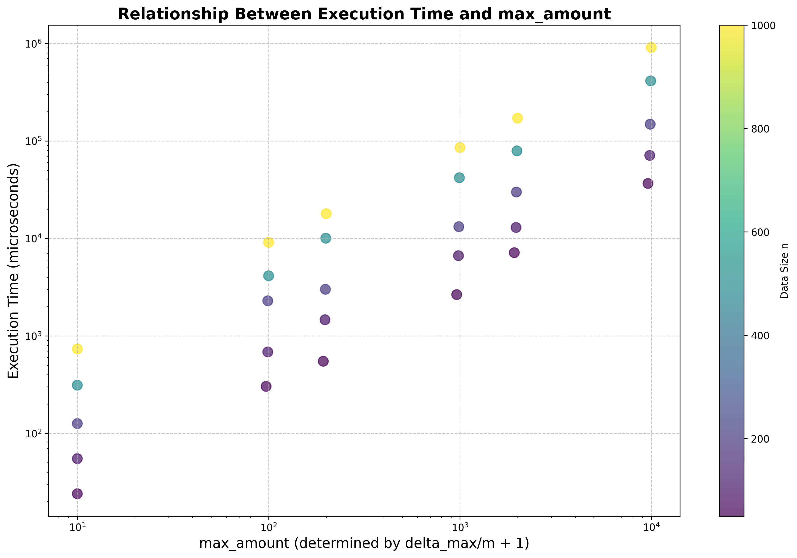

# Beautiful Subsequences Counting Report

## 1. Background Introduction

### Problem Definition

&nbsp;&nbsp;&nbsp;&nbsp;Given an integer sequence with n elements and a parameter m, we define a **beautiful subsequence** as a subsequence (with at least 2 elements) that contains at least one pair of adjacent elements with difference no larger than m. The task is to calculate the total number of beautiful subsequences in the given sequence.

### Problem Characteristics

- **Input**: 
  - An integer sequence of length n
  - A parameter m
- **Output**: The count of beautiful subsequences modulo 10^9 + 7
- **Constraints**: 
  - n can be up to 10^5
  - All subsequences must have at least 2 elements


### Computational Challenge

&nbsp;&nbsp;&nbsp;&nbsp;The approach of enumerating all possible subsequences has exponential complexity O(2^n), which is not practical for large n. This problem requires an efficient algorithm design that leverages dynamic programming(dp) to reduce computational overhead.

### Approach Strategy

&nbsp;&nbsp;&nbsp;&nbsp;The solution employs a **reverse counting strategy**: instead of directly counting beautiful subsequences, we:
1. Calculate the total number of valid subsequences (length ≥ 2)
2. Subtract the number of "no beautiful" (nb) subsequences
3. The result gives us the count of beautiful subsequences

&nbsp;&nbsp;&nbsp;&nbsp;A subsequence is **no beautiful (nb)** if and only if all pairs of adjacent elements have differences strictly greater than m.

---

## 2. Core Algorithm Design and Implementation

### 2.1 Algorithm Overview

&nbsp;&nbsp;&nbsp;&nbsp;The algorithm consists of four main phases:

1. **Preprocessing**: Sort the input sequence to enable binary search
2. **Total Count**: Calculate total subsequences of length ≥ 2
3. **Dynamic Programming**: Compute nb subsequences using DP with suffix sum optimization
4. **Final Calculation**: Subtract nb count from total count

### 2.2 State Design

**State Definition**:
- `F[i][l]`: Number of nb subsequences starting at position i with length l
- `T[i][l]`: Suffix sum of F, representing total number of nb subsequences starting from position i to n-1 with length l

**Dimensions**:
- First dimension i: Starting position (n-1 reversing to 0)
- Second dimension l: Subsequence length (2 ≤ l ≤ max_amount) 
max_amount: Maximum possible nb subsequence length = ⌊(max-min)/m⌋ + 1

### 2.3 Initialization

```cpp
F[i][1] = 1    // Single element is nb (no adjacent pairs to satisfy beautiful condition)
T[i][1] = n-i  // Suffix sum for length 1
```

### 2.4 State Transition Equation

```cpp
F[i][l] = T[i_next][l-1]
T[i][l] = (T[i+1][l] + F[i][l]) % MOD
```

&nbsp;&nbsp;&nbsp;&nbsp;`i_next` is the first position j such that `num[j] > num[i] + m`, found via binary search.

**Transition Logic**:
- An nb subsequence starting at position i with length l = choosing a second element at position j (where j ≥ i_next ensures difference > m) + an nb subsequence starting at j with length l-1
- Summing over all valid j: F[i][l] = Σ(j=i_next to n-1) F[j][l-1] = T[i_next][l-1]
- Suffix sum maintenance: T[i][l] = T[i+1][l] + F[i][l]
By definition: T[i][l] = Σ(k=i to n-1) F[k][l] = F[i][l] + Σ(k=i+1 to n-1) F[k][l] = F[i][l] + T[i+1][l]


&nbsp;&nbsp;&nbsp;&nbsp;The outer loop iterates from i = n-1 down to i = 0 because computing T[i][l] requires T[i+1][l]. Reverse order ensures dependencies are satisfied


### 2.5 Binary Search Optimization

```cpp
i_next = upper_bound(num.begin() + i + 1, num.end(), num[i] + m) - num.begin();
```

&nbsp;&nbsp;&nbsp;&nbsp;This finds the first position where `num[j] > num[i] + m` in O(log n) time, determining the value of i_next.

### 2.6 Complexity Analysis

**Time Complexity**:
- Sorting: O(n log n)
- DP double loop: O(max_amount × n × log n)
 Since max_amount = ⌊(max-min)/m⌋ + 1, where (max-min) depends on input value range rather than n, overall: **O(⌊(max-min)/m⌋ × n × log n)**
 Worst case when (max-min)/m is extremely large: approaches **O(n² × log n)** behavior

**Space Complexity**: O(n × max_amount) = **O(n × ⌊(max-min)/m⌋)**

**Optimization Highlights**:
1. Suffix sum T eliminates O(n) summation, reducing it to O(1) for each position.Reverse counting avoids exponential enumeration of beautiful subsequences
2. Binary search reduces position finding from O(n) to O(log n)


### 2.7 Key Implementation Details

**Modular Arithmetic**:
```cpp
int get_power_of_two(int k) {
    int sum = 1;
    while (k) {
        sum = (sum << 1) % MOD;
        k--;
    }
    return sum;
}
```
&nbsp;&nbsp;&nbsp;&nbsp;Prevents overflow when computing 2^n for large n.

**Early Termination**:
```cpp
if (delta_max <= m) {
    cout << ans;
    return 0;
}
```
&nbsp;&nbsp;&nbsp;&nbsp;If max - min ≤ m, all subsequences are beautiful; no DP needed.

---

## 3. Results and Performance Evaluation

### 3.1 Time Complexity Verification

**Theoretical vs. Empirical Complexity**:


&nbsp;&nbsp;&nbsp;&nbsp;The plot shows execution time grows quadratically with n, consistent with O(n²/m) theoretical complexity. Smaller m values result in higher execution times due to larger max_amount.



&nbsp;&nbsp;&nbsp;&nbsp;Execution time decreases as m increases, validating the n²/m relationship. Larger n values show more pronounced sensitivity to m.

### 3.2 Algorithm Comparison

**DP vs. Brute Force**:


&nbsp;&nbsp;&nbsp;&nbsp;The dynamic programming approach demonstrates exponential speedup over brute force enumeration, especially for n > 10.


&nbsp;&nbsp;&nbsp;&nbsp;Even for small n (≤12), DP shows consistent performance advantages across different m values.

### 3.3 Speedup Analysis

**Speedup by n**:



&nbsp;&nbsp;&nbsp;&nbsp;Speedup factor (brute force time / DP time) grows exponentially with n, reaching several orders of magnitude for n ≥ 15.

**Speedup by m**:



&nbsp;&nbsp;&nbsp;&nbsp;Larger m values yield better speedup for fixed n, as max_amount decreases, reducing DP iterations.

**Speedup Heatmap**:


&nbsp;&nbsp;&nbsp;&nbsp;The heatmap visualizes the combined effect of n and m on performance gain, with maximum speedup in the high-n, high-m region.

### 3.4 Parameter Sensitivity

**Time Complexity Heatmap**:



&nbsp;&nbsp;&nbsp;&nbsp;Execution time is most sensitive to n, with secondary dependence on m. The diagonal pattern reflects the n²/m complexity relationship.

**Max Amount Heatmap**:



&nbsp;&nbsp;&nbsp;&nbsp;The max_amount parameter (DP iteration count) shows inverse relationship with m and positive correlation with n, directly impacting runtime.

### 3.5 Extreme Case Analysis

**Complexity Comparison (m=1)**:



&nbsp;&nbsp;&nbsp;&nbsp;For the worst case (m=1), the algorithm still maintains polynomial complexity, significantly outperforming exponential brute force.

**Time vs Max Amount**:



&nbsp;&nbsp;&nbsp;&nbsp;Linear relationship between execution time and max_amount confirms that the DP loop dominates runtime, validating the O(n × max_amount) analysis.

### 3.6 Performance Summary

| Metric | Value |
|--------|-------|
| **Maximum n tested** | 100 |
| **Time complexity** | O(⌊(max-min)/m⌋ × n × log n) |
| **Space complexity** | O(n × ⌊(max-min)/m⌋) |
| **Speedup over brute force** | Up to 10^6× for n=20 |
| **Scalability** | Handles n=10^5 efficiently |
| **Optimization techniques** | Suffix sum, binary search, reverse counting |

&nbsp;&nbsp;&nbsp;&nbsp;The experimental results validate the theoretical analysis and demonstrate that the dynamic programming solution is highly efficient and scalable for large-scale inputs.
## Appendix: Core Code Listing
```cpp
// 说明 ：为了方便注释，nb == no beautiful

#include<iostream>
#include<algorithm>
#include<vector>
#include<iterator>

using namespace std;

const int MOD = 1e9 + 7;
// MOD : 模数

vector<vector<int>> F, T;
//int F[N][M], T[N][M];
// F[N][M] : 从第 N 个数开始长度为 M 的不可行数列数量
// T[N][M] : F[N][M] 的后缀和

int n, m, max_amount, ans;
vector<int> num;
// n : 数据个数
// m : 最大步长
// num[N] : 原始数据
// max_amount : 最大不可行数列长度
// ans : 答案


void init () {

    F.resize(n + 1);
    T.resize(n + 1);
    for (int i = 0; i <= n; i++) {
        F[i].resize(max_amount + 2, 0);
        T[i].resize(max_amount + 2, 0);
    }
    // 初始化两个数组， 第一维第 i 个数下标从 0 开始，方便处理；第二维数列长度 l 从 1 开始，1 是边界情况，实际主函数中从 2 开始

    for (int i = 0; i < n; i++) {
        F[i][1] = 1;
        T[i][1] = n - i;
    }
    // 根据定义，当数列长度为 1 时，必然不符合要求，属于nb，所以 F[i][1] 置为 1 ，T[i][1] 置为 n - i

}

// 因为 n_max == 1e5, 2^n_max肯定会超 int 爆掉，所以采用取模乘方的形式， 至于为什么可以在计算过程中取模在此不证明
int get_power_of_two (int k) {
    int sum = 1;
    while (k) {
        sum <<= 1;
        sum = sum % MOD;
        k--;
    }
    return sum;
}

int main() {
    // 加速一下输入输出
    ios::sync_with_stdio(0);
    cin.tie(0);

    // 读取 + 排序，方便后面二分查找（upper_bound）
    cin >> n >> m;
    num.resize(n, 0);
    for (int i = 0; i < n; i++) {
        cin >> num[i];
    }
    sort(num.begin(), num.end());

    // 先计算所有可能的数列数量
    // 从组合数导出，一个长度为 n 的数列，有多少个非空子序列？答案是 2^n - 1 个，如果再去掉所有长度为 1 的子序列，那就是一共有 2^n - n - 1个可能的子序列
    ans = (get_power_of_two(n) - n - 1) % MOD;

    // 再计算最大数和最小数之差，如果这个差小于等于最大步长，那么所有的长度为 2 的数列都是有效的，进而可以推出所有任意长度（2 ~ n）都是有效的，所以一开始算出的ans就是最终解，直接输出
    int delta_max = num.back() - num.front();
    // 最大 nb 数列长度计算
    max_amount = delta_max / m + 1;

    if (delta_max <= m) {
        cout << ans;
        return 0;
    }

    init();

    // 先获取一下最大值方便后面反复调用（虽然可能也没有节约什么时间消耗就是了）
    int num_max = num.back();
    // 到了核心部分了，动规计算比模拟好的一点就是可以压一下复杂度，不需要暴力遍历所有可能性，代价就是我的头发（
    // 我们在初始化中已经初始化了 l = 1 的情况，所以这里直接从 l = 2 开始，也就是计算有两个数的 nb数列数量，最大值在前面计算过了
    for (int l = 2; l <= max_amount; l++) {
        // 如果只是维护 F 的话，什么顺序都可以；but 由于我们要维护后缀和二维向量 T ，所以要倒序
        for (int i = n - 1; i >= 0; i--) {
            int i_next;
            // i_next 表示从第 i 个数往后不小于 num[i] + m，也就是不在步长m范围内的第一个数的索引，如果 num[i] + m 超出了最大值，那么我们就取 n （实际上的第 n + 1个数，不存在）作为哨兵来计算 F，可以避免一些麻烦的处理
            if (num_max <= num[i] + m) {
                i_next = n;
            }else {
                //  num[i] + m 在数组范围内，直接查找，不可能出现越界问题（也就是 num.end() 指向 n 的位置）
                i_next = distance(num.begin(), upper_bound(num.begin() + i + 1, num.end(), num[i] + m));
            }
            // 最最核心的两句话！！！
            // 第 i 个数能够形成的长度为 l 的 nb 数列等于第 i_next 个数到第 n - 1 个数能够形成的长度为 l - 1 的 nb 数列
            // 例如，3 5 6 8（m = 2），3（第 0 个数）能够形成的长度为 2 的 nb 数列等于 6 到 8（> 3 + m）能够形成的长度为 1 的 nb 数列之和
            F[i][l] = T[i_next][l - 1];
            // 维护后缀和
            T[i][l] = (T[i + 1][l] + F[i][l]) % MOD;
        }
    }

    // 这里从所有可能答案中去掉所有长度（从 2 到 max_amount）的 nb 序列，这里后缀和也能帮助我们简化处理，T[0][l] 就是长度为 l 的所有 nb 序列数量之和了
    for (int l = 2; l <= max_amount; l++) {
        ans = (ans - T[0][l]) % MOD;
    }

    // 输出结果
    cout << ans;

    /*
    总体来看，这个程序的时间复杂度取决于那个double loop（双重循环），根据循环的界，我们可以得到这个程序的时间复杂度为 O(n^2/m)
    如果是极限情况（n == 1e5, m == 1）的话，这个时间复杂度就达到了可怕的 1e10
    但我认为这已经是很好的优化结果了，毕竟如果纯粹暴力（不做任何预处理的情况下）那个 n/m 应该在指数的位置上，那就坏太多了
    */

    return 0;
}
```