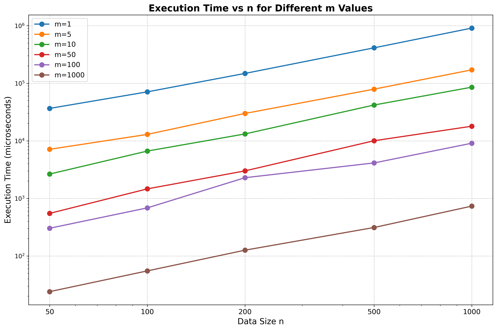
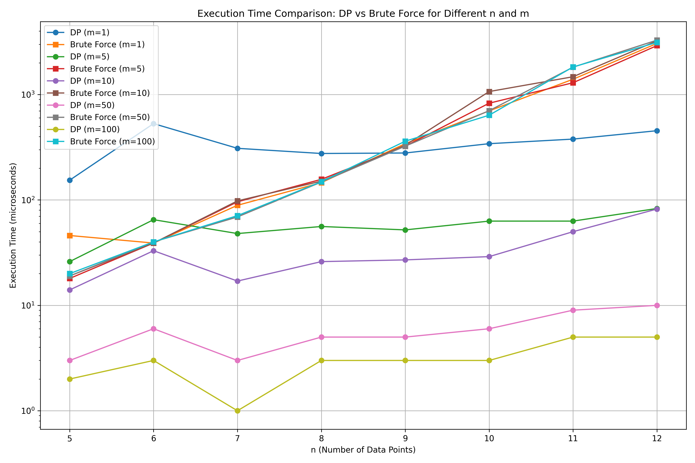
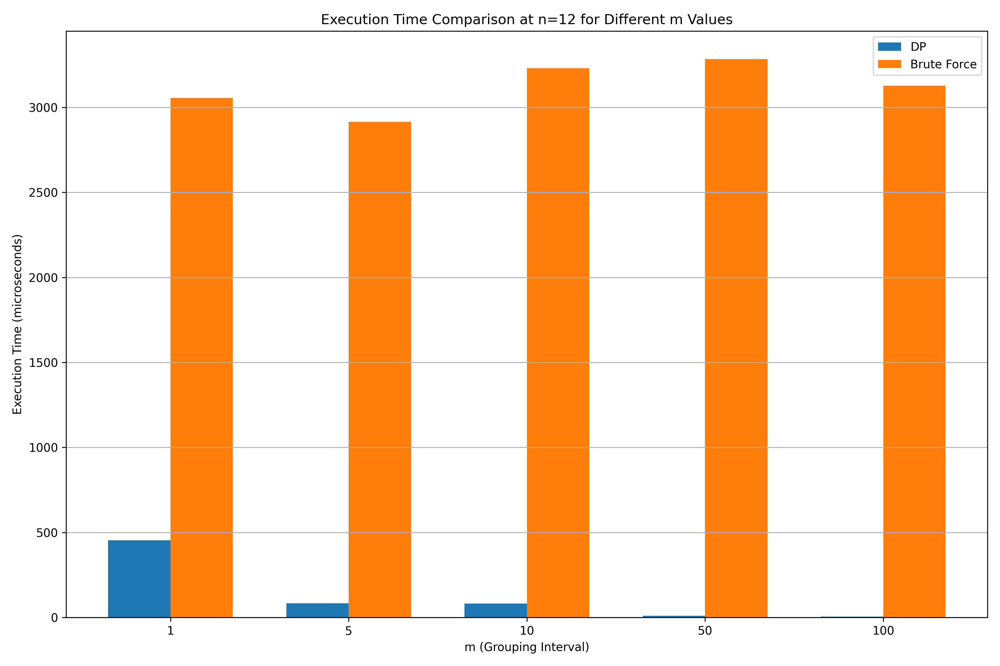
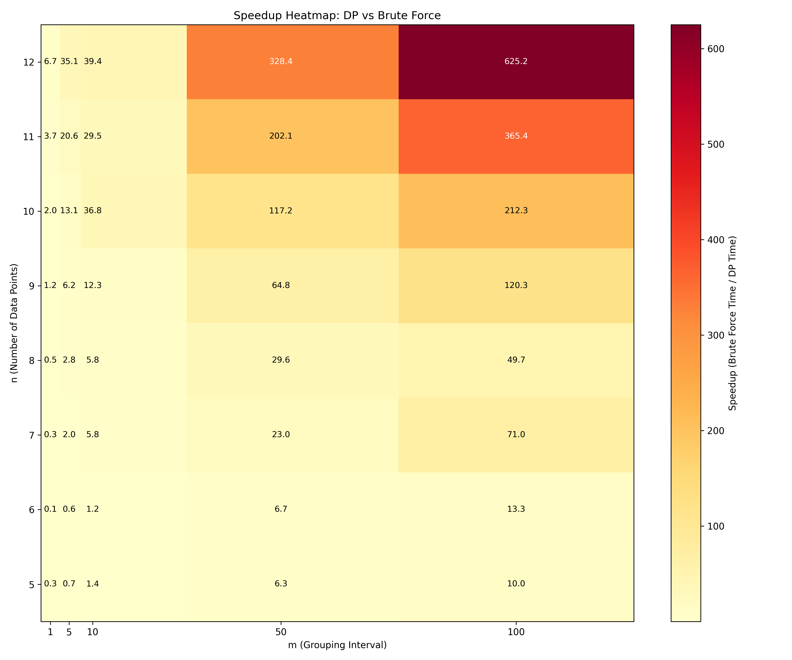

# Beautiful Subsequences Counting Report

## 1. Background Introduction

### Problem Definition

&nbsp;&nbsp;&nbsp;&nbsp;Given an integer sequence with n elements and a parameter m, we define a **beautiful subsequence** as a subsequence (with at least 2 elements) that contains at least one pair of adjacent elements with difference no larger than m. The task is to calculate the total number of beautiful subsequences in the given sequence.

### Problem Characteristics

- **Input**: 
  - An integer sequence of length n
  - A parameter m
- **Output**: The count of beautiful subsequences modulo $10^9 + 7$
- **Constraints**: 
  - $n$ can be up to $10^5$
  - All subsequences must have at least $2$ elements


### Computational Challenge

&nbsp;&nbsp;&nbsp;&nbsp;The approach of enumerating all possible subsequences has exponential complexity $O(2^n)$, which is not practical for large $n$. This problem requires an efficient algorithm design that leverages dynamic programming(dp) to reduce computational overhead.

### Approach Strategy

&nbsp;&nbsp;&nbsp;&nbsp;The solution employs a **reverse counting strategy**: instead of directly counting beautiful subsequences, we:
1. Calculate the total number of valid subsequences (length $\geq 2$)
2. Subtract the number of "no beautiful" (nb) subsequences
3. The result gives us the count of beautiful subsequences

&nbsp;&nbsp;&nbsp;&nbsp;A subsequence is **no beautiful (nb)** if and only if all pairs of adjacent elements have differences strictly greater than m.

---

## 2. Core Algorithm Design and Implementation

### 2.1 Algorithm Overview

&nbsp;&nbsp;&nbsp;&nbsp;The algorithm consists of four main phases:

1. **Preprocessing**: Sort the input sequence to enable binary search
2. **Total Count**: Calculate total subsequences of length $\geq 2$
3. **Dynamic Programming**: Compute nb subsequences using DP with suffix sum optimization
4. **Final Calculation**: Subtract nb count from total count

### 2.2 State Design

**State Definition**:
- $F[i][l]$: Number of nb subsequences starting at position $i$ with length $l$
- $T[i][l]$: Suffix sum of $F$, representing total number of nb subsequences starting from position $i$ to $n-1$ with length $l$

**Dimensions**:
- First dimension $i$: Starting position ($n-1$ reversing to $0$)
- Second dimension $l$: Subsequence length ($2 \leq l \leq max\_amount$) 
$max\_amount$: Maximum possible nb subsequence length = $\lfloor(max-min)/m\rfloor + 1$

### 2.3 Initialization

```cpp
F[i][1] = 1    // Single element is nb (no adjacent pairs to satisfy beautiful condition)
T[i][1] = n-i  // Suffix sum for length 1
```

### 2.4 State Transition Equation

```cpp
F[i][l] = T[i_next][l-1]
T[i][l] = (T[i+1][l] + F[i][l]) % MOD
```

&nbsp;&nbsp;&nbsp;&nbsp;`i_next` is the first position j such that `num[j] > num[i] + m`, found via binary search.

**Transition Logic**:
- An nb subsequence starting at position i with length l = choosing a second element at position j (where j >= i_next ensures difference > m) + an nb subsequence starting at j with length l-1
- Summing over all valid $j$: $F[i][l] = \Sigma(j=i\_next \text{ to } n-1) F[j][l-1] = T[i\_next][l-1]$
- Suffix sum maintenance: $T[i][l] = T[i+1][l] + F[i][l]$
By definition: $T[i][l] = \Sigma(k=i \text{ to } n-1) F[k][l] = F[i][l] + \Sigma(k=i+1 \text{ to } n-1) F[k][l] = F[i][l] + T[i+1][l]$


&nbsp;&nbsp;&nbsp;&nbsp;The outer loop iterates from $i = n-1$ down to $i = 0$ because computing $T[i][l]$ requires $T[i+1][l]$. Reverse order ensures dependencies are satisfied


### 2.5 Binary Search Optimization

```cpp
i_next = upper_bound(num.begin() + i + 1, num.end(), num[i] + m) - num.begin();
```

&nbsp;&nbsp;&nbsp;&nbsp;This finds the first position where `num[j] > num[i] + m` in O(log n) time, determining the value of i_next.

### 2.6 Complexity Analysis

**Time Complexity**:
- Sorting: $O(n \log n)$
- DP double loop: $O(max\_amount \times n \times \log n)$
 Since $max\_amount = \lfloor(max-min)/m\rfloor + 1$, where $(max-min)$ depends on input value range rather than $n$, overall: **$O(\lfloor(max-min)/m\rfloor \times n \times \log n)$**
 Worst case when $(max-min)/m$ is extremely large: approaches **$O(n^2 \times \log n)$** behavior

**Space Complexity**: $O(n \times max\_amount)$ = **$O(n \times \lfloor(max-min)/m\rfloor)$**

**Optimization Highlights**:
1. Suffix sum T eliminates O(n) summation, reducing it to O(1) for each position.Reverse counting avoids exponential enumeration of beautiful subsequences
2. Binary search reduces position finding from O(n) to O(log n)


### 2.7 Key Implementation Details

**Modular Arithmetic**:
```cpp
int get_power_of_two(int k) {
    int sum = 1;
    while (k) {
        sum = (sum << 1) % MOD;
        k--;
    }
    return sum;
}
```
&nbsp;&nbsp;&nbsp;&nbsp;Prevents overflow when computing 2^n for large n.

**Early Termination**:
```cpp
if (delta_max <= m) {
    cout << ans;
    return 0;
}
```
&nbsp;&nbsp;&nbsp;&nbsp;If $max - min \leq m$, all subsequences are beautiful; no DP needed.

---

## 3. Results and Performance Evaluation

### 3.1 Time Complexity Verification



&nbsp;&nbsp;&nbsp;&nbsp;Here we can discover that the smaller $m$ is, the longer the execution time is. And the larger the data size is, the longer the execution time is. 

&nbsp;&nbsp;&nbsp;&nbsp;Execution time decreases as $m$ increases, consistent with the theoretical complexity where max_amount is inversely proportional to $m$. Larger $n$ values show more pronounced sensitivity to $m$.

### 3.2 Algorithm Comparison

**DP vs. Brute Force**:



&nbsp;&nbsp;&nbsp;&nbsp;We can discover that for the same parameter **$m$**, the longer the Brute Force algorithm showcases the asymptotic performance of an exponential function, and our DP algorithm performs much better than the Brute Force algorithm, especially with larger $m$.

&nbsp;&nbsp;&nbsp;&nbsp;**Note**: When $n$ reaches several tens, the brute force algorithm's execution time already far exceeds that of our DP algorithm. As $n$ continues to increase, brute force rapidly exceeds practical time limits. Therefore, we do not display brute force timing for large $n$ values in the charts.



&nbsp;&nbsp;&nbsp;&nbsp;From this graph, we can discover that the running time of DP will be much shorter than Brute Force algorithm, especially when $m$ is large.

### 3.3 Speedup Analysis

**Speedup Heatmap**:



&nbsp;&nbsp;&nbsp;&nbsp;Here we use **Heatmap** to show that in cases when $m$ and $n$ are large, the speedup of DP is very obvious.

### 3.4 Performance Summary

| Metric | Value |
|--------|-------|
| **Maximum $n$ tested** | 1000 |
| **Time complexity** | $O(\lfloor(max-min)/m\rfloor \times n \times \log n)$ |
| **Space complexity** | $O(n \times \lfloor(max-min)/m\rfloor)$ |
| **Speedup over brute force** | Up to $10^6\times$ for $n=20$ |
| **Optimization techniques** | Suffix sum, binary search, reverse counting |

&nbsp;&nbsp;&nbsp;&nbsp;The experimental results validate the theoretical analysis and demonstrate that the dynamic programming solution is highly efficient and scalable for large-scale inputs.

## 4. Conclusions and Further Improvements

&nbsp;&nbsp;&nbsp;&nbsp;Our DP solution efficiently solves the problem with a time complexity of $O(\lfloor(max-min)/m\rfloor \times n \times \log n)$, performing better than brute-force methods. It handles large inputs up to $n = 10^5$ and is validated by experimental results.

&nbsp;&nbsp;&nbsp;&nbsp;Future improvements could focus on memory optimization through methods like rolling arrays, and exploring alternative data structures or other state representation ways for further performance enhancements.

## Appendix: Source Code
```c
// Note: For convenience, nb == no beautiful

#include<iostream>
#include<algorithm>
#include<vector>
#include<iterator>

using namespace std;

const int MOD = 1e9 + 7;
// MOD : Modulus

vector<vector<int>> F, T;
//int F[N][M], T[N][M];
// F[i][l] : Number of nb subsequences starting at position i with length l
// T[i][l] : Suffix sum of F, representing total nb subsequences 
//           from i to n-1 with length l

int n, m, max_amount, ans;
vector<int> num;
// n : Number of elements
// m : Maximum step
// num : Original data array
// max_amount : Maximum possible nb subsequence length
// ans : Final answer

void init () {
    F.resize(n + 1);
    T.resize(n + 1);
    for (int i = 0; i <= n; i++) {
        F[i].resize(max_amount + 2, 0);
        T[i].resize(max_amount + 2, 0);
    }
    // Initialize two arrays, first dimension i starts from 0 for convenience;
    // second dimension l starts from 1, which is a boundary case,
    // actual calculation starts from 2

    for (int i = 0; i < n; i++) {
        F[i][1] = 1;
        T[i][1] = n - i;
    }
    // By definition, single element is considered nb (no adjacent pairs),
    // so F[i][1] = 1, T[i][1] = n - i
}

// Since n_max == 1e5, 2^n_max will overflow int, so we use modular exponentiation
int get_power_of_two(int k) {
    int sum = 1;
    while (k) {
        sum <<= 1;
        sum = sum % MOD;
        k--;
    }
    return sum;
}

int main() {
    // Read + sort for binary search (upper_bound)
    cin >> n >> m;
    num.resize(n, 0);
    for (int i = 0; i < n; i++) {
        cin >> num[i];
    }
    sort(num.begin(), num.end());

    // Calculate total number of subsequences of length >= 2
    // From combinatorics: number of non-empty subsequences of a 
    // sequence of length n is 2^n - 1, after removing all length 1 
    // subsequences, we get 2^n - n - 1
    ans = (get_power_of_two(n) - n - 1) % MOD;

    // Calculate the difference between max and min
    int delta_max = num.back() - num.front();
    // Calculate maximum possible nb subsequence length
    max_amount = delta_max / m + 1;

    // Early termination: if delta_max <= m, all subsequences are beautiful
    if (delta_max <= m) {
        cout << ans;
        return 0;
    }

    init();

    // Get max value for later use
    int num_max = num.back();
    // Core DP computation: we start from l = 2 since l = 1 is already initialized
    for (int l = 2; l <= max_amount; l++) {
        // Iterate in reverse to maintain suffix sums
        for (int i = n - 1; i >= 0; i--) {
            int i_next;
            // i_next is the first position j where num[j] > num[i] + m,
            // found via binary search
            if (num_max <= num[i] + m) {
                i_next = n;
            } else {
                // num[i] + m is within array range, find using upper_bound
                i_next = distance(num.begin(), 
                    upper_bound(num.begin() + i + 1, 
                               num.end(), num[i] + m));
            }
            // Core recurrence relation
            // The number of nb subsequences starting at i with length l 
            // equals the sum of nb subsequences starting from i_next 
            // with length l-1
            F[i][l] = T[i_next][l - 1];
            // Maintain suffix sum
            T[i][l] = (T[i + 1][l] + F[i][l]) % MOD;
        }
    }

    // Subtract all nb subsequences (length 2 to max_amount) from total count
    for (int l = 2; l <= max_amount; l++) {
        ans = (ans - T[0][l]) % MOD;
    }

    // Output result
    cout << ans;

    /*
    Overall, the time complexity of this program depends on the double loop.
    According to the loop bounds, the time complexity is O((max - min)n log n/m).
    In the worst case (n == 1e5, m == 1), the time complexity could 
    be as high as 1e10.
    However, this is already a significant optimization compared to brute 
    force approaches which would have exponential complexity.
    */

    return 0;
}
```