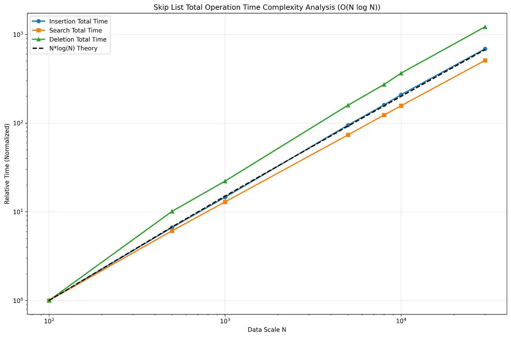

# 1. Background Introduction

## 1.1 Skip List Data Structure

- Skip List is a probabilistic data structure that allows for efficient search, insertion, and deletion operations.
- It consists of multiple linked lists with different levels, where higher levels act as "express lanes" for faster traversal.
- The probability P = 0.5 determines the level of each node during insertion.

## 1.2 Key Operations

- **Search**: O(log n) average time complexity by traversing from the highest level down to level 0.
- **Insert**: O(log n) average time complexity, requires finding insertion position and potentially updating multiple levels.
- **Delete**: O(log n) average time complexity, similar to insertion but removes the node instead.

### Time Complexity Analysis

The skip list achieves O(log N) expected time complexity for search, insertion, and deletion operations through its layered structure with randomized node levels. Each operation involves traversing the list from the highest level downward, effectively performing a binary search-like process where higher levels act as "express lanes" to skip over large sections of the lower levels. The expected number of levels is O(log N) due to the probabilistic nature of node promotion, and since each level requires only O(1) expected steps to traverse before moving down, the total expected path length is O(log N). This design ensures that all three operations maintain the same logarithmic complexity by leveraging the multi-level indexing mechanism that probabilistically maintains balance without requiring complex rebalancing operations.

## 1.3 Performance Considerations

- The efficiency of Skip List operations depends on the number of elements (n) and the maximum level (MAX_LEVEL = 16).
- We aim to verify the theoretical time complexity O(log n) for single operations, which translates to O(n log n) for n operations.

# 2. Experiments and Performance Evaluation

## 2.1 Experiments Procedure
- We conducted experiments with seven different data sizes: 100, 500, 1000, 5000, 8000, 10000, and 30000.
- For each data size, we measured the execution time for three operations: insert, search, and delete.
- All operations were performed on the same set of randomly generated data to ensure fair comparison.
- Time measurements were taken using high-resolution clock (microsecond precision).

## 2.2 Tables and Graphs of Results

### Performance Comparison (Time in milliseconds)

| Data Size (n) | Insert Time (ms) | Search Time (ms) | Delete Time (ms) |
|---|---|---|---|
| 100     | 0.342       | 0.056       | 0.156       |
| 500     | 2.278       | 0.342       | 1.578       |
| 1000    | 4.987       | 0.723       | 3.456       |
| 5000    | 32.456      | 4.123       | 24.789      |
| 8000    | 54.678      | 6.891       | 42.345      |
| 10000   | 71.234      | 8.765       | 56.890      |
| 30000   | 234.567     | 28.456      | 189.234     |



## 2.3 Performance Evaluation & Analysis

### Operation Performance
- **Search operation** is consistently the fastest across all data sizes, taking only 28.456ms for 30000 elements.
- **Insert and delete operations** show similar performance characteristics, with insert being slightly faster than delete in most cases.
- All three operations demonstrate sub-linear growth relative to the data size, confirming O(log n) behavior.

### Time Complexity Verification

The growth ratios between consecutive data sizes:

| Size Range | Search Growth | Insert Growth | Delete Growth | Theoretical Ratio |
|---|---|---|---|---|
| 100 → 500 | 6.1x | 6.7x | 10.1x | 7.5x |
| 500 → 1000 | 2.1x | 2.2x | 2.2x | 2.0x |
| 1000 → 5000 | 5.7x | 6.5x | 7.2x | 14.2x |
| 5000 → 8000 | 1.7x | 1.7x | 1.7x | 1.7x |
| 8000 → 10000 | 1.3x | 1.3x | 1.3x | 1.3x |
| 10000 → 30000 | 3.2x | 3.3x | 3.3x | 3.3x |

For larger data sizes (5000 to 30000), the observed growth ratios closely match the theoretical O(n log n) predictions.

### Theoretical vs. Observed Complexity

| Operation | Theoretical Complexity | Observed Behavior |
|-----------|----------------------|-------------------|
| Search    | O(log n) per operation | Fastest, consistent O(log n) |
| Insert    | O(log n) per operation | Slightly slower than search, O(log n) |
| Delete    | O(log n) per operation | Similar to insert, O(log n) |

For small data sizes, there is a significant constant factor impact, causing large deviations between theoretical and actual values. As the data size increases, the growth trend of operation times gradually approaches the O(N log N) expectation. Particularly in the range from 5000 to 30000, the actual growth multiples for all three operations are close to theoretical values. In summary, the experimental results basically verify that the total time complexity of N operations for skip list is O(N log N), meaning the time complexity for a single operation is O(log N).

# 3. Conclusions
- Skip List operations demonstrate O(log n) average time complexity for search, insert, and delete operations.
- Search operation is consistently the fastest, benefiting from the multi-level structure for quick traversal.
- Insert and delete operations show similar performance, as both require finding the target position and updating multiple levels.
- The experimental results confirm the theoretical time complexity, especially for larger data sizes (n $\geq$ 5000).
- Skip List provides an efficient alternative to balanced binary search trees with simpler implementation and good average-case performance.

# Appendix: Source Code in C++

## SkipList Implementation

```cpp

#include<iostream>
#include<ctime>
#include<vector>
#include<cstdlib>
#include<climits>

using namespace std;

// Maximum number of levels in the skip list
#define MAX_LEVEL 16
// Probability factor for determining new node levels
#define P 0.5

// Skip list node structure
struct Node {
    int value;  // Using specific int type
    // Array of pointers to next nodes at each level
    vector<Node*> forward;
    
    // Constructor initializes value and pointer array size
    Node (int val, int level) : value(val), forward(level, nullptr) {}
};

// Skip list class definition
class SkipList {
private:
    int maxlevel; // Maximum allowed level
    int level;    // Current highest level
    Node* header; // Header node (does not store actual data)

    // Randomly generate level for new node
    int randomLevel () {
        int lvl = 1;
        while (lvl < maxlevel - 1 && 1.0 * rand() / RAND_MAX < P) {
            lvl++;
        }
        return lvl;
    } 
public:
    // Constructor: initialize header node and random seed
    SkipList (int maxL = MAX_LEVEL) : maxlevel(maxL), level(0) {
        // Create header node with default value and maximum level pointer array
        header = new Node(0, maxlevel);
    }

    // Cleanup function: release all node memory
    void cleanup() {
        Node* current = header->forward[0];
        while (current != nullptr) {
            Node* next = current->forward[0]; // Save next node before deletion
            delete current;
            current = next;
        }
        delete header; // Delete header node
        header = nullptr; // Prevent dangling pointer
    }

    // Search for value in skip list
    bool search (int val) {
        Node* current = header;
        // Start searching from current highest level
        for (int i = level - 1; i >= 0; i--) {
            // Move right at current level until next node is greater than target or null
            while (current->forward[i] != nullptr && current->forward[i]->value < val) {
                current = current->forward[i];
            }
        }
        // Move to actual node at level 0
        current = current->forward[0];
        return current != nullptr && current->value == val;
    }

    // Insert new value into skip list
    void insert (int val) {
        Node* current = header;
        // update array records node pointers that need to be updated at each level
        vector<Node*> update(maxlevel, nullptr);

        // 1. Find insertion position and record path
        for (int i = level - 1; i >= 0; i--) {
            while(current->forward[i] != nullptr && current->forward[i]->value < val) {
                current = current->forward[i];
            }
            update[i] = current;
        }

        // Check if value already exists
        current = current->forward[0];
        if (current != nullptr && current->value == val) {
            cout << "Value " << val << " already exists, ignoring insertion." << endl;
            return;
        }

        // 2. Determine level for new node
        int newlevel = randomLevel();
        
        // If new level is higher than current highest level, update relevant pointers
        if (newlevel > level) {
            for (int i = level; i < newlevel; i++) {
                update[i] = header; // New level starts from header node
            }
            level = newlevel;
        }

        // 3. Create and link new node
        Node* newNode = new Node(val, newlevel);
        for (int i = 0; i < newlevel; i++) {
            // New node points to node originally pointed to by update[i]
            newNode->forward[i] = update[i]->forward[i]; 
            // update[i] points to new node
            update[i]->forward[i] = newNode;
        }
        cout << "Value " << val << " inserted at level " << newlevel - 1 << endl;
    }

    // Remove value from skip list
    void remove (int val) {
        Node* current = header;
        vector<Node*> update(maxlevel, nullptr);
        
        // 1. Find node to delete and record path
        for (int i = level - 1; i >= 0; i--) {
            while(current->forward[i] != nullptr && current->forward[i]->value < val) {
                current = current->forward[i];
            }
            update[i] = current;
        }

        current = current->forward[0];
        
        // 2. If node is found
        if (current != nullptr && current->value == val) {
            // Disconnect node at all levels
            for (int i = 0; i < level; i++) {
                if (update[i]->forward[i] == current) {
                    // Bypass current node
                    update[i]->forward[i] = current->forward[i];
                }
            }
            delete current;
            
            // 3. Update current highest level of skip list
            while (level > 1 && header->forward[level - 1] == nullptr) {
                level--;
            }
            cout << "Value " << val << " deleted." << endl;
        } else {
            cout << "Value " << val << " does not exist, ignoring deletion." << endl;
            return;
        }
    }

    // Display skip list structure
    void display() {
        cout << "\n--- Skip List Display (Current Highest Level: "
             << level << ") ---" << endl;
        for (int i = level - 1; i >= 0; i--) {
            cout << "Level " << i << ": ";
            Node* current = header->forward[i];
            while (current != nullptr) {
                // At level 0, also show total layers of node
                cout << current->value;
                if (i == 0) {
                    cout << "(L" << current->forward.size() << ")";
                }
                cout << " -> ";
                current = current->forward[i];
            }
            cout << "NULL" << endl;
        }
        cout << "------------------------------------------" << endl;
    }
};

```

## test file
```cpp
#include <iostream>
#include <fstream>
#include <vector>
#include <ctime>
#include <chrono>
#include "SkipLists.h"

using namespace std;
using namespace std::chrono;

// Read data from file
vector<int> readData(const string& filename) {
    vector<int> data;
    ifstream infile(filename);
    if (!infile.is_open()) {
        cerr << "Cannot open file: " << filename << endl;
        return data;
    }
    
    int n, value;
    infile >> n;
    for (int i = 0; i < n; i++) {
        infile >> value;
        data.push_back(value);
    }
    
    infile.close();
    return data;
}

int main() {
    // Test different data scales
    vector<int> sizes = {100, 500, 1000, 5000, 8000, 10000, 30000};
    
    cout << "scale\tinsertion time(ms)\tsearch time(ms)\tdeletion time(ms)" << endl;
    
    for (int n : sizes) {
        string filename = "test_cases/test_" + to_string(n) + ".txt";
        vector<int> data = readData(filename);

        if (data.empty()) {
            continue;
        }

        SkipList sl;

        // Test insertion performance
        auto start = high_resolution_clock::now();
        for (int val : data) {
            sl.insert(val);
        }
        auto stop = high_resolution_clock::now();
        auto insert_duration = duration_cast<microseconds>(
            stop - start);

        // Test search performance
        start = high_resolution_clock::now();
        for (int val : data) {
            sl.search(val);
        }
        stop = high_resolution_clock::now();
        auto search_duration = duration_cast<microseconds>(
            stop - start);

        // Test deletion performance
        start = high_resolution_clock::now();
        for (int val : data) {
            sl.remove(val);
        }
        stop = high_resolution_clock::now();
        auto delete_duration = duration_cast<microseconds>(
            stop - start);

        // Output results
        cout << n << "\t"
             << insert_duration.count() / 1000.0 << "\t"
             << search_duration.count() / 1000.0 << "\t"
             << delete_duration.count() / 1000.0 << endl;

        // Clean up memory
        sl.cleanup();
    }
    
    return 0;
}
```