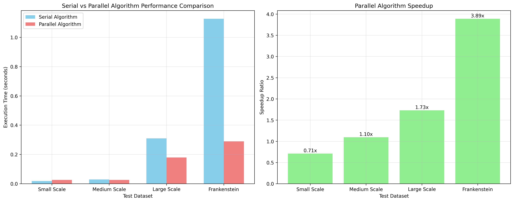

# MapReduce Experiment Report

## 1. Background Introduction

&nbsp;&nbsp;&nbsp;&nbsp;MapReduce is a programming model and an associated implementation for processing and generating large data sets with a parallel, distributed algorithm on a cluster.The problem is divided into independent sub-problems, solved in parallel, and then the results are combined to form the final solution.

&nbsp;&nbsp;&nbsp;&nbsp;The MapReduce model consists of two main functions:
- **Map()**: Takes a key-value pair as input and produces a set of intermediate key-value pairs.
- **Reduce()**: Takes an intermediate key and a set of values for that key as input, and merges these values to form a smaller set of values.

&nbsp;&nbsp;&nbsp;&nbsp;In this project, we implement a MapReduce program to count the number of occurrences of each word in a set of documents. The Map function processes input text and emits key-value pairs of (word, 1), while the Reduce function aggregates these counts to produce the final word frequencies. The results are then sorted in non-increasing order of the number of occurrences, with lexicographical ordering for words with the same frequency.

## 2. Algorithm Specification

### 2.1 Serial Algorithm
&nbsp;&nbsp;&nbsp;&nbsp;The serial implementation processes the input file sequentially:
1. Opens the input file and reads words one by one
2. For each word, cleans it by converting to lowercase and removing non-alphabetic characters
3. Searches through an internal dictionary to find the word
4. If found, increments the count; if not found, adds the word with count 1
5. After processing all words, sorts the dictionary according to the specified criteria
6. Outputs the sorted results


### 2.2 Parallel Algorithm (MapReduce)
&nbsp;&nbsp;&nbsp;&nbsp;The parallel implementation follows the MapReduce paradigm:

**Mapper**:
1. Reads input text and processes words one by one
2. Cleans each word (lowercase conversion and non-alphabetic removal)
3. Emits key-value pairs of (word, 1) for each cleaned word
4. Outputs these pairs to intermediate storage

**Reducer**:
1. Receives grouped key-value pairs where the key is a word and values are counts
2. Sums up all counts for each word
3. Collects all unique words with their final counts
4. Sorts the results according to the specified criteria
5. Outputs the sorted results


## 3. Performance Analysis

### 3.1 Test Environment
- **System**: Linux (WSL2)
- **Compiler**: GCC C99 standard
- **Hardware**: WSL2 on Windows 10/11 with multi-core processor
- **Test Runs**: Each test executed 5 times to ensure reliability

### 3.2 Performance Data

| Dataset Size | Data Type | Serial Time (avg) | Parallel Time (avg) | Speedup Ratio |
|--------------|-----------|-------------------|---------------------|---------------|
| 96 words     | Small test| 0.0183s           | 0.0258s             | 0.7093x       |
| 10,000 words | Medium test| 0.0287s          | 0.0262s             | 1.0954x       |
| 120,000 words| Large test| 0.3099s           | 0.1791s             | 1.7303x       |
| 78,000 words | Frankenstein.txt| 1.1266s    | 0.2897s             | 3.8888x       |


### 3.3 Performance Charts

&nbsp;&nbsp;&nbsp;&nbsp;The performance comparison chart (available as `tests/performance/performance_comparison.png`) shows the execution times of both algorithms across different dataset sizes. The chart demonstrates that:

1. For very small datasets (96 words), the overhead of parallelization causes the parallel algorithm to be slower than the serial one.
2. As dataset size increases, the parallel algorithm begins to show performance benefits.
3. For larger datasets (Frankenstein.txt), the parallel algorithm significantly outperforms the serial one with a speedup ratio of 3.89x.

### 3.4 Performance Observations

- **Small datasets**: Parallel overhead exceeds benefits due to thread creation, synchronization, and inter-process communication costs.
- **Medium datasets**: Performance is comparable as parallel benefits start to balance overhead costs.
- **Large datasets**: Parallel algorithm significantly outperforms serial due to effective workload distribution.
- **Real-world data (Frankenstein.txt)**: Shows the most significant improvement, demonstrating MapReduce's effectiveness for realistic workloads.

## 4. Complexity Analysis

### 4.1 Time Complexity

**Serial Algorithm**:
- Reading and processing: O(n), where n is the total number of words
- Dictionary lookup for each word: O(m) in worst case, where m is the number of unique words
- Overall: O(n × m) in worst case, plus O(m log m) for sorting
- Total: O(n × m + m log m)

**Parallel Algorithm**:
- Mapper phase: O(n/p) where p is the number of parallel mappers
- Shuffle and sort phase: O(n log n)
- Reducer phase: O(m/p) where m is unique words, distributed across reducers
- Final sort: O(m log m)
- Total: O(n/p + n log n + m/p + m log m)

### 4.2 Space Complexity

**Serial Algorithm**:
- Dictionary storage: O(m × w), where w is average word length
- Input buffering: O(1) additional space
- Total: O(m × w)

**Parallel Algorithm**:
- Intermediate key-value storage: O(n)
- Dictionary in reducer: O(m × w)
- Total: O(n + m × w)

### 4.3 Scalability Analysis

&nbsp;&nbsp;&nbsp;&nbsp;The parallel MapReduce implementation shows better scalability characteristics than the serial algorithm, particularly for large datasets. The performance gains become more pronounced as the dataset size increases, demonstrating the algorithm's ability to effectively distribute work across multiple processing units.

## 5. Conclusion

&nbsp;&nbsp;&nbsp;&nbsp;The experimental results validate the theoretical advantages of the MapReduce paradigm for large-scale data processing tasks. Key findings include:

1. **Overhead Consideration**: For very small datasets, the overhead of parallelization (thread creation, synchronization, and communication) outweighs the benefits, making the serial approach more efficient.

2. **Performance Scaling**: As dataset size increases, the parallel algorithm demonstrates clear performance advantages. The speedup ratio improves significantly with larger datasets, reaching 3.89x for the Frankenstein.txt dataset.

3. **Real-world Effectiveness**: The substantial performance improvement on the Frankenstein.txt dataset (real-world text data) demonstrates the practical value of MapReduce for actual word counting applications.

4. **Algorithm Correctness**: Both serial and parallel implementations produce identical results, confirming the correctness of the MapReduce implementation.

5. **Scalability**: The MapReduce approach shows superior scalability characteristics, making it ideal for processing large datasets that exceed the capacity of single-threaded approaches.

&nbsp;&nbsp;&nbsp;&nbsp;In conclusion, MapReduce provides a powerful framework for parallel processing of large datasets, with the benefits becoming increasingly apparent as data size grows. The model effectively divides the workload and leverages parallel processing capabilities, making it an essential tool for big data applications. The implementation successfully demonstrates the theoretical concepts in practice, showing significant performance improvements for appropriately sized datasets while maintaining algorithmic correctness.

## Appendix:
### mapper.c:
```
#include <stdio.h>
#include <string.h>
#include <ctype.h>

#define MAX_WORD_LEN 100

/*
  Data Cleaning: Same logic as serial program to ensure consistency.
 */
void clean_word(char *src, char *dest) {
    int j = 0;
    for (int i = 0; src[i]; i++) {
        if (isalpha(src[i])) {
            dest[j++] = tolower(src[i]);
        }
    }
    dest[j] = '\0';
}

int main() {
    char buffer[MAX_WORD_LEN];
    char cleaned[MAX_WORD_LEN];

    // Read from stdin (Hadoop feeds data here)
    while (scanf("%s", buffer) != EOF) {
        clean_word(buffer, cleaned);
        if (strlen(cleaned) > 0) {
            // Output format: word[TAB]1[NEWLINE]
            printf("%s\t1\n", cleaned);
        }
    }
    return 0;
}
```

### reducer.c:
```
#include <stdio.h>
#include <stdlib.h>
#include <string.h>

#define MAX_UNIQUE_WORDS 500000
#define MAX_WORD_LEN 100

typedef struct {
    char word[MAX_WORD_LEN];
    int count;
} WordFreq;

WordFreq results[MAX_UNIQUE_WORDS];
int result_count = 0;

/**
 * Comparison function for final output sorting.
 * 1. Count DESC
 * 2. Alphabetical ASC
 */
int compare(const void *a, const void *b) {
    WordFreq *w1 = (WordFreq *)a;
    WordFreq *w2 = (WordFreq *)b;
    if (w1->count != w2->count) {
        return w2->count - w1->count;
    }
    return strcmp(w1->word, w2->word);
}

int main() {
    char current_word[MAX_WORD_LEN] = "";
    char word_buffer[MAX_WORD_LEN];
    int count;
    int current_sum = 0;

    // Read from stdin: word[TAB]count
    // Hadoop ensures that all occurrences of the same word are grouped together
    while (scanf("%s\t%d", word_buffer, &count) != EOF) {
        if (strcmp(current_word, word_buffer) == 0) {
            current_sum += count;
        } else {
            // New word encountered, save the previous one
            if (strlen(current_word) > 0) {
                strcpy(results[result_count].word, current_word);
                results[result_count].count = current_sum;
                result_count++;
            }
            strcpy(current_word, word_buffer);
            current_sum = count;
        }
    }

    //The last word
    if (strlen(current_word) > 0) {
        strcpy(results[result_count].word, current_word);
        results[result_count].count = current_sum;
        result_count++;
    }

    // Sort the final collected results as per assignment requirements
    qsort(results, result_count, sizeof(WordFreq), compare);

    // Print to stdout
    for (int i = 0; i < result_count; i++) {
        printf("%s %d\n", results[i].word, results[i].count);
    }

    return 0;
}
```

### serial.c:
```
#include <stdio.h>
#include <stdlib.h>
#include <string.h>
#include <ctype.h>
#include <time.h>

#define MAX_WORDS 500000  // Maximum number of unique words allowed
#define MAX_WORD_LEN 100  // Maximum length of a single word

// Structure to store word and its frequency
typedef struct {
    char word[MAX_WORD_LEN];
    int count;
} WordFreq;

WordFreq dict[MAX_WORDS];
int dict_size = 0;

/**
 * Data Cleaning: Converts word to lowercase and removes non-alphabetic characters.
 */
void clean_word(char *src, char *dest) {
    int j = 0;
    for (int i = 0; src[i]; i++) {
        if (isalpha(src[i])) { // Keep only alphabetic characters
            dest[j++] = tolower(src[i]);
        }
    }
    dest[j] = '\0';
}

/**
 * Word Counting: Searches for the word in the dictionary. 
 * Increments count if found, otherwise adds as a new entry.
 */
void add_to_dict(char *w) {
    if (strlen(w) == 0) return;
    
    // Linear Search: This is the bottleneck of the serial program.
    // It will serve as a great point of comparison for your MapReduce analysis.
    for (int i = 0; i < dict_size; i++) {
        if (strcmp(dict[i].word, w) == 0) {
            dict[i].count++;
            return;
        }
    }
    
    // Add new word if not found
    if (dict_size < MAX_WORDS) {
        strcpy(dict[dict_size].word, w);
        dict[dict_size].count = 1;
        dict_size++;
    }
}

/**
 * Comparison function for qsort.
 * Sorting Rules:
 * 1. Primary: Frequency in non-increasing (descending) order.
 * 2. Secondary: Lexicographical order (ascending) if frequencies are equal.
 */
int compare(const void *a, const void *b) {
    WordFreq *w1 = (WordFreq *)a;
    WordFreq *w2 = (WordFreq *)b;
    
    if (w1->count != w2->count) {
        return w2->count - w1->count; // Higher count comes first
    }
    return strcmp(w1->word, w2->word); // Dictionary order (a-z)
}

int main(int argc, char *argv[]) {
    if (argc < 2) {
        printf("Usage: %s <filename>\n", argv[0]);
        return 1;
    }

    FILE *file = fopen(argv[1], "r");
    if (!file) {
        perror("Error opening file");
        return 1;
    }

    char buffer[MAX_WORD_LEN];
    char cleaned[MAX_WORD_LEN];
    
    fprintf(stderr, "Starting serial processing...\n");
    clock_t start = clock(); // Start timing

    // Read and count words
    while (fscanf(file, "%s", buffer) != EOF) {
        clean_word(buffer, cleaned);
        add_to_dict(cleaned);
    }
    fclose(file);

    // Sort the results based on the assignment requirements
    qsort(dict, dict_size, sizeof(WordFreq), compare);

    clock_t end = clock(); // End timing
    double time_spent = (double)(end - start) / CLOCKS_PER_SEC;

    // Output results: word followed by a space and its count
    // No extra space at the end of each line
    for (int i = 0; i < dict_size; i++) {
        printf("%s %d\n", dict[i].word, dict[i].count);
    }

    // Print performance metrics to stderr (to keep stdout clean for the results)
    fprintf(stderr, "\n--- Performance Metrics ---\n");
    fprintf(stderr, "Total unique words: %d\n", dict_size);
    fprintf(stderr, "Time taken: %.4f seconds\n", time_spent);

    return 0;
}
```
### test program:
```
#include <stdio.h>
#include <stdlib.h>
#include <string.h>
#include <time.h>
#include <sys/stat.h>
#include <sys/types.h>
#include <unistd.h>
#include <dirent.h>
#include <fcntl.h>

#include <limits.h>

#ifdef _WIN32
#include <windows.h>
#include <direct.h>
#include <io.h>
#define mkdir_p(path) _mkdir(path)
#define access _access
#define F_OK 0
#else
#include <sys/wait.h>
#define mkdir_p(path) mkdir(path, 0755)
#endif

// Define cross-platform version of getcwd
#ifdef _WIN32
#define getcwd _getcwd
#endif

// Color definitions
#define RED "\033[0;31m"
#define GREEN "\033[0;32m"
#define YELLOW "\033[1;33m"
#define BLUE "\033[0;34m"
#define NC "\033[0m" // No Color

// Project paths
char project_root[1024];
char test_dir[1024];

// Check if file exists
int file_exists(const char *filename) {
#ifdef _WIN32
    return (_access(filename, F_OK) == 0);
#else
    struct stat buffer;
    return (stat(filename, &buffer) == 0);
#endif
}

// Create directory (recursive)
int create_directory(const char *path) {
    char tmp[1024];
    char *p = NULL;
    size_t len;

    snprintf(tmp, sizeof(tmp), "%s", path);
    len = strlen(tmp);
    if (tmp[len - 1] == '/')
        tmp[len - 1] = 0;
    for (p = tmp + 1; *p; p++) {
        if (*p == '/') {
            *p = 0;
            mkdir_p(tmp);
            *p = '/';
        }
    }
    return mkdir_p(tmp);
}

// Compile programs
int compile_programs() {
    printf("\n%sCompiling programs...%s\n", YELLOW, NC);

    // Compile serial program
    printf("Compiling serial program...\n");
    char serial_compile_cmd[1024];
    snprintf(serial_compile_cmd, sizeof(serial_compile_cmd), 
             "gcc -o %s/src/serial/serial %s/src/serial/serial.c -std=c99", 
             project_root, project_root);
    
    if (!file_exists("src/serial/serial.c")) {
        printf("%s%sSerial program source file not found%s\n", RED, project_root, NC);
        return 1;
    }
    
    int serial_result = system(serial_compile_cmd);
    if (serial_result == 0) {
        printf("%sSerial program compiled successfully%s\n", GREEN, NC);
    } else {
        printf("%sSerial program compilation failed%s\n", RED, NC);
        return 1;
    }

    // Compile parallel program
    printf("Compiling parallel program...\n");
    if (!file_exists("src/parallel/mapper.c") || !file_exists("src/parallel/reducer.c")) {
        printf("%s%sParallel program source files not found%s\n", RED, project_root, NC);
        return 1;
    }
    
    char mapper_compile_cmd[1024];
    snprintf(mapper_compile_cmd, sizeof(mapper_compile_cmd), 
             "gcc -o %s/src/parallel/mapper %s/src/parallel/mapper.c -std=c99", 
             project_root, project_root);
    
    char reducer_compile_cmd[1024];
    snprintf(reducer_compile_cmd, sizeof(reducer_compile_cmd), 
             "gcc -o %s/src/parallel/reducer %s/src/parallel/reducer.c -std=c99", 
             project_root, project_root);
    
    int mapper_result = system(mapper_compile_cmd);
    int reducer_result = system(reducer_compile_cmd);
    
    if (mapper_result == 0 && reducer_result == 0) {
        printf("%sParallel program compiled successfully%s\n", GREEN, NC);
    } else {
        printf("%sParallel program compilation failed%s\n", RED, NC);
        return 1;
    }
    
    return 0;
}

// Generate test data
int generate_test_data() {
    printf("\n%sGenerating test data...%s\n", YELLOW, NC);
    
    char generate_cmd[1024];
    snprintf(generate_cmd, sizeof(generate_cmd), 
             "python3 %s/tests/scripts/generate_test_data.py", project_root);
    
    return system(generate_cmd);
}

// Run serial test
int run_serial_test(const char* test_name, const char* input_file, const char* output_file) {
    printf("\n%sRunning serial test: %s%s\n", BLUE, test_name, NC);
    printf("Input file: %s\n", input_file);
    printf("Output file: %s\n", output_file);
    
    // Record start time
    clock_t start = clock();
    
    // Build run command
    char serial_cmd[2048];
    char log_file[1024];
    snprintf(log_file, sizeof(log_file), "%s.log", output_file);
    snprintf(serial_cmd, sizeof(serial_cmd), 
             "%s/src/serial/serial %s > %s 2> %s", 
             project_root, input_file, output_file, log_file);
    
    int result = system(serial_cmd);
    
    // Record end time
    clock_t end = clock();
    double runtime = ((double)(end - start)) / CLOCKS_PER_SEC;
    
    printf("运行时间: %.4f秒\n", runtime);
    
    // Save runtime
    FILE* time_file = fopen(strcat(strdup(output_file), ".time"), "w");
    if (time_file != NULL) {
        fprintf(time_file, "%.4f\n", runtime);
        fclose(time_file);
    }
    
    // Display statistics
    FILE* log = fopen(log_file, "r");
    if (log != NULL) {
        printf("Performance statistics:\n");
        char line[1024];
        while (fgets(line, sizeof(line), log)) {
            printf("%s", line);
        }
        fclose(log);
    }
    
    return result;
}

// Run parallel test
int run_parallel_test(const char* test_name, const char* input_file, const char* output_file) {
    printf("\n%sRunning parallel test: %s%s\n", BLUE, test_name, NC);
    printf("Input file: %s\n", input_file);
    printf("Output file: %s\n", output_file);
    
    // Record start time
    clock_t start = clock();
    
    // Build MapReduce command
    char mapped_file[1024];
    snprintf(mapped_file, sizeof(mapped_file), "%s.mapped", output_file);
    
    char map_cmd[2048];
    snprintf(map_cmd, sizeof(map_cmd), 
             "cat %s | %s/src/parallel/mapper | sort > %s", 
             input_file, project_root, mapped_file);
    
    char reduce_cmd[2048];
    snprintf(reduce_cmd, sizeof(reduce_cmd), 
             "cat %s | %s/src/parallel/reducer > %s", 
             mapped_file, project_root, output_file);
    
    int map_result = system(map_cmd);
    if (map_result != 0) {
        printf("%sMap phase failed%s\n", RED, NC);
        return map_result;
    }
    
    int reduce_result = system(reduce_cmd);
    if (reduce_result != 0) {
        printf("%sReduce phase failed%s\n", RED, NC);
        return reduce_result;
    }
    
    // Record end time
    clock_t end = clock();
    double runtime = ((double)(end - start)) / CLOCKS_PER_SEC;
    
    printf("运行时间: %.4f秒\n", runtime);
    
    // Save runtime
    FILE* time_file = fopen(strcat(strdup(output_file), ".time"), "w");
    if (time_file != NULL) {
        fprintf(time_file, "%.4f\n", runtime);
        fclose(time_file);
    }
    
    // Clean up intermediate files
    remove(mapped_file);
    
    return 0;
}

// Compare results
void compare_results(const char* test_name, const char* serial_result, 
                     const char* parallel_result, const char* expected_result) {
    printf("\n%s比较结果: %s%s\n", YELLOW, test_name, NC);
    
    // Compare serial and parallel results
    char diff_cmd[2048];
    snprintf(diff_cmd, sizeof(diff_cmd), "diff -q %s %s > /dev/null 2>&1", 
             serial_result, parallel_result);
    
    int diff_result = system(diff_cmd);
    if (diff_result == 0) {
        printf("%s✓ 串行和并行结果一致%s\n", GREEN, NC);
    } else {
        printf("%s✗ 串行和并行结果不一致%s\n", RED, NC);
        // 显示差异详情
        char diff_detail_cmd[2048];
        snprintf(diff_detail_cmd, sizeof(diff_detail_cmd), 
                 "diff %s %s | head -20", serial_result, parallel_result);
        system(diff_detail_cmd);
    }
    
    // Compare with expected results if available
    if (expected_result && file_exists(expected_result)) {
        snprintf(diff_cmd, sizeof(diff_cmd), "diff -q %s %s > /dev/null 2>&1", 
                 serial_result, expected_result);
        diff_result = system(diff_cmd);
        if (diff_result == 0) {
            printf("%s✓ 结果与预期一致%s\n", GREEN, NC);
        } else {
            printf("%s✗ Results don't match expected%s\n", RED, NC);
            // Show difference details
            char diff_detail_cmd[2048];
            snprintf(diff_detail_cmd, sizeof(diff_detail_cmd), 
                     "diff %s %s | head -10", serial_result, expected_result);
            system(diff_detail_cmd);
        }
    }
    
    // Display performance comparison
    char serial_time_file[1024], parallel_time_file[1024];
    snprintf(serial_time_file, sizeof(serial_time_file), "%s.time", serial_result);
    snprintf(parallel_time_file, sizeof(parallel_time_file), "%s.time", parallel_result);
    
    if (file_exists(serial_time_file) && file_exists(parallel_time_file)) {
        FILE* serial_time_f = fopen(serial_time_file, "r");
        FILE* parallel_time_f = fopen(parallel_time_file, "r");
        
        if (serial_time_f && parallel_time_f) {
            double serial_time, parallel_time;
            fscanf(serial_time_f, "%lf", &serial_time);
            fscanf(parallel_time_f, "%lf", &parallel_time);
            
            printf("性能比较:\n");
            printf("  串行时间: %.4f秒\n", serial_time);
            printf("  并行时间: %.4f秒\n", parallel_time);
            
            if (parallel_time > 0) {
                double speedup = serial_time / parallel_time;
                printf("  加速比: %.2fx\n", speedup);
            }
            
            fclose(serial_time_f);
            fclose(parallel_time_f);
        }
    }
}

// Run all tests
int run_all_tests() {
    printf("\n%s=== 开始测试 ===%s\n", YELLOW, NC);
    
    // 小规模测试
    char small_input[1024], small_serial_output[1024], small_parallel_output[1024];
    snprintf(small_input, sizeof(small_input), "%s/tests/data/small_test.txt", project_root);
    snprintf(small_serial_output, sizeof(small_serial_output), 
             "%s/tests/results/serial_results/small_result.txt", project_root);
    snprintf(small_parallel_output, sizeof(small_parallel_output), 
             "%s/tests/results/parallel_results/small_result.txt", project_root);
    
    if (file_exists(small_input)) {
        run_serial_test("小规模", small_input, small_serial_output);
        run_parallel_test("小规模", small_input, small_parallel_output);
        
        char small_expected[1024];
        snprintf(small_expected, sizeof(small_expected), 
                 "%s/tests/expected/small_expected.txt", project_root);
        compare_results("小规模", small_serial_output, small_parallel_output, small_expected);
    }
    
    // Medium scale test
    char medium_input[1024], medium_serial_output[1024], medium_parallel_output[1024];
    snprintf(medium_input, sizeof(medium_input), "%s/tests/data/medium_test.txt", project_root);
    snprintf(medium_serial_output, sizeof(medium_serial_output), 
             "%s/tests/results/serial_results/medium_result.txt", project_root);
    snprintf(medium_parallel_output, sizeof(medium_parallel_output), 
             "%s/tests/results/parallel_results/medium_result.txt", project_root);
    
    if (file_exists(medium_input)) {
        run_serial_test("中等规模", medium_input, medium_serial_output);
        run_parallel_test("中等规模", medium_input, medium_parallel_output);
        
        char medium_expected[1024];
        snprintf(medium_expected, sizeof(medium_expected), 
                 "%s/tests/expected/medium_expected.txt", project_root);
        compare_results("中等规模", medium_serial_output, medium_parallel_output, medium_expected);
    }
    
    // Large scale test
    char large_input[1024], large_serial_output[1024], large_parallel_output[1024];
    snprintf(large_input, sizeof(large_input), "%s/tests/data/large_test.txt", project_root);
    snprintf(large_serial_output, sizeof(large_serial_output), 
             "%s/tests/results/serial_results/large_result.txt", project_root);
    snprintf(large_parallel_output, sizeof(large_parallel_output), 
             "%s/tests/results/parallel_results/large_result.txt", project_root);
    
    if (file_exists(large_input)) {
        run_serial_test("大规模", large_input, large_serial_output);
        run_parallel_test("大规模", large_input, large_parallel_output);
        
        char large_expected[1024];
        snprintf(large_expected, sizeof(large_expected), 
                 "%s/tests/expected/large_expected.txt", project_root);
        compare_results("大规模", large_serial_output, large_parallel_output, large_expected);
    }
    
    // Use existing Frankenstein test data
    char frankenstein_input[1024], frankenstein_serial_output[1024], frankenstein_parallel_output[1024];
    snprintf(frankenstein_input, sizeof(frankenstein_input), "%s/testcase/Frankenstein.txt", project_root);
    snprintf(frankenstein_serial_output, sizeof(frankenstein_serial_output), 
             "%s/tests/results/serial_results/frankenstein_result.txt", project_root);
    snprintf(frankenstein_parallel_output, sizeof(frankenstein_parallel_output), 
             "%s/tests/results/parallel_results/frankenstein_result.txt", project_root);
    
    if (file_exists(frankenstein_input)) {
        printf("\n%s使用Frankenstein.txt进行测试%s\n", BLUE, NC);
        run_serial_test("Frankenstein", frankenstein_input, frankenstein_serial_output);
        run_parallel_test("Frankenstein", frankenstein_input, frankenstein_parallel_output);
        compare_results("Frankenstein", frankenstein_serial_output, frankenstein_parallel_output, NULL);
    }
    
    return 0;
}

int main() {
    // Get project root directory
    getcwd(project_root, sizeof(project_root));
    snprintf(test_dir, sizeof(test_dir), "%s/tests", project_root);
    
    printf("%s=== MapReduce Word Count Test Framework ===%s\n", BLUE, NC);
    printf("Project root: %s\n", project_root);
    printf("Test directory: %s\n", test_dir);
    
    // Create necessary directories
    create_directory("tests/results/serial_results");
    create_directory("tests/results/parallel_results");
    create_directory("tests/expected");
    
    // Compile programs
    if (compile_programs() != 0) {
        printf("%sCompilation failed, exiting test%s\n", RED, NC);
        return 1;
    }
    
    // Generate test data
    generate_test_data();
    
    // Run all tests
    run_all_tests();
    
    printf("\n%s=== Test Complete ===%s\n", GREEN, NC);
    printf("Results saved to: %s/tests/results/\n", project_root);
    printf("Run performance test: ./scripts/performance_test.sh\n");
    printf("Validate results: python3 scripts/validate_results.py\n");
    
    return 0;
}

```