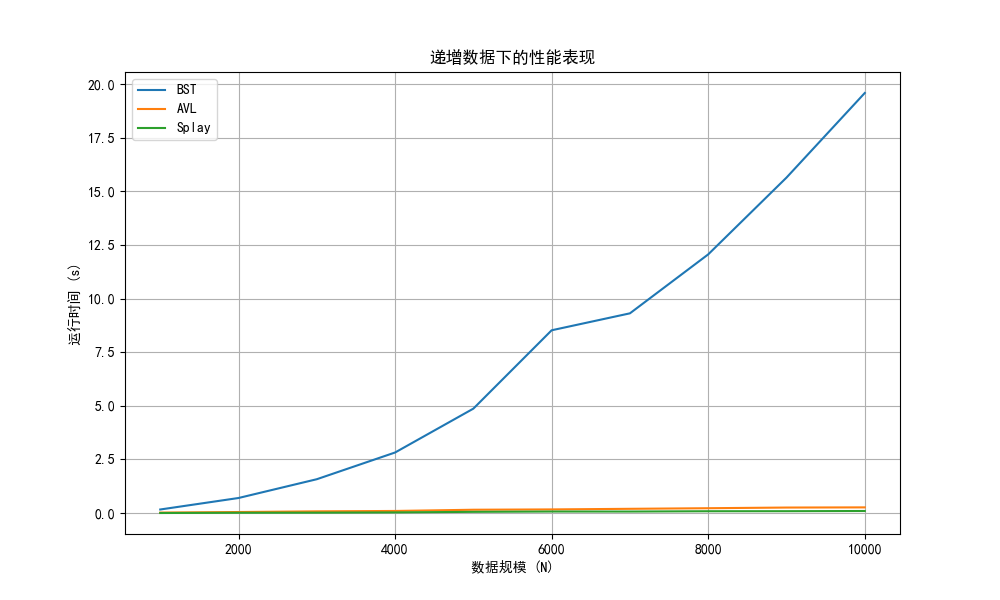

# 1. Background Introduction

## 1.1 Binary Search Trees

- Binary Search Trees include a wide variety of algorithms whose implementations share a common feature: for a given node, all values in the left subtree are less than the node's value, and all values in the right subtree are greater than the node's value.
- There are various strategies for manipulating elements, and for restructuring the tree to improve overall performance.

## 1.2 Existing Problems

- If we use unbalanced binary search trees, the tree may degenerate into a structure resembling a linked list under certain insertion orders (increasing order for example), resulting in $O(N)$ time complexity in the worst case.
- This leads to unstable performance across different input patterns, which is undesirable for efficient data storage.

## 1.3 Possible Solutions

- To ensure performance stability, we aim to maintain the height of the tree within $O(\log N)$.
- Using basic operations such as `leftRotate()` and `rightRotate()`, balancing methods can be implemented to solve tree imbalance and preserve efficient operations.

# 2. Experiments and Performance Evaluation

## 2.1 Experiments Procedure
- We conducted experiments on three types of binary search trees: Unbalanced Binary Search Trees, AVL trees, and Splay trees.
- Firstly, we programmed several functions to perform insertions and deletions. "Insert" and "Delete" are core functions for each, "rebalanceAVL", "leftrotate", "rightrotate" for AVL tree, and "splay", "leftrotate", "rightrotate" for Splay trees. We then used the "time" function to measure the execution time of each operation. "Main.c" combines all the functions into one program, serving as the entry point of our program. Finally, we used "run_analyzer.py" to get the results.
- For each tree type, we performed insertions and deletions. Three types of orders are considered: "inc" for increasing order, "dec" for decreasing order, and "rand" for random order. We achieve this by reversing and shuffling the input data in "main.c".
- Considering that AVL Tree and Splay Tree both perform well with short execution time of insertions and deletions, we repeated the experiments 100 times for each tree type, in order to get a more accurate result.
Here are the results of our experiments, for deletion type "inc", "dec" and "rand":

## 2.2 Tables and Graphs of Results

#### Incremental Data Performance

| Data Scale(N) | BST Running Time(s) | AVL Running Time(s) | Splay Running Time(s) |
|---|---|---|---|
| 1000 | 0.361000 | 0.048000 | 0.020000 |
| 2000 | 1.403000 | 0.107000 | 0.034000 |
| 3000 | 3.354000 | 0.158000 | 0.061000 |
| 4000 | 5.872000 | 0.225000 | 0.091000 |
| 5000 | 9.061000 | 0.280000 | 0.103000 |
| 6000 | 13.907000 | 0.330000 | 0.127000 |
| 7000 | 19.189000 | 0.419000 | 0.143000 |
| 8000 | 24.591000 | 0.426000 | 0.151000 |
| 9000 | 30.795000 | 0.506000 | 0.168000 |
| 10000 | 38.366000 | 0.587000 | 0.175000 |



#### Decremental Data Performance

| Data Scale(N) | BST Running Time(s) | AVL Running Time(s) | Splay Running Time(s) |
|---|---|---|---|
| 1000 | 0.793000 | 0.054000 | 0.014000 |
| 2000 | 3.230000 | 0.106000 | 0.029000 |
| 3000 | 7.551000 | 0.169000 | 0.046000 |
| 4000 | 13.987000 | 0.252000 | 0.075000 |
| 5000 | 21.594000 | 0.290000 | 0.070000 |
| 6000 | 32.182000 | 0.408000 | 0.111000 |
| 7000 | 43.014000 | 0.429000 | 0.118000 |
| 8000 | 56.953000 | 0.480000 | 0.140000 |
| 9000 | 69.678000 | 0.574000 | 0.141000 |
| 10000 | 87.619000 | 0.645000 | 0.181000 |


#### Random Data Performance

| Data Scale(N) | BST Running Time(s) | AVL Running Time(s) | Splay Running Time(s) |
|---|---|---|---|
| 1000 | 0.018000 | 0.050000 | 0.044000 |
| 2000 | 0.063000 | 0.145000 | 0.111000 |
| 3000 | 0.117000 | 0.240000 | 0.174000 |
| 4000 | 0.148000 | 0.333000 | 0.249000 |
| 5000 | 0.206000 | 0.414000 | 0.311000 |
| 6000 | 0.264000 | 0.556000 | 0.401000 |
| 7000 | 0.293000 | 0.597000 | 0.471000 |
| 8000 | 0.355000 | 0.697000 | 0.555000 |
| 9000 | 0.418000 | 0.817000 | 0.648000 |
| 10000 | 0.496000 | 0.894000 | 0.689000 |


## 2.3 Performance Evaluation & Analysis

#### Incremental Data Performance
- BST performs terribly bad. With incremental data, this tree has degenerated into a linear chain. The time complexity of every insertion or deletion is O(n), so totally its complexity is O(n²).
- For AVL tree and Splay tree, the time complexity of every insertion or deletion is O(log n), so totally its complexity is O(n log n).
- Splay tree consistently performs better than AVL tree.
- Analysis: 
Splay tree Advantages compared with AVL tree:
For monotonic data, insertions are concentrated on the left side of the tree, requiring fewer rotations and resulting in faster speed. AVL tree need frequent rotations to maintain balance, requiring more time.


#### Decremental Data Performance
- Nearly the same as Incremental Data Performance

- The decremental data of deletion makes Splay tree even more faster, because the tree just need to delete the root in every operation.

#### Random Data Performance
- BST achieves its theoretical O(n log n) complexity
- All types of trees perform well, in which BST performs pretty excellent, better than balanced trees.
- Splay Tree is faster than AVL
- Analysis
Due to the randomness of the data, BST trees do not degenerate, so their simplicity makes them the fastest. Rules of AVL trees are the most strict. So AVL trees have the most frequent rotation operations. Splay have less rotation operations. Therefore, the required time for insertion and deletion: AVL > Splay > BST.

Theoretical vs. Observed Complexity:

| Tree Type | Data Distribution | Theoretical | Observed Behavior |
|-----------|------------------|-------------|-------------------|
| BST       | Random          | O(n log n)  |  O(n log n)     |
| BST       | Ordered         | O(n²)       |  O(n²)          |
| AVL       | All             | O(n log n)  |  O(n log n)     |
| Splay     | All             | O(n log n) |  O(n log n)     |

# 3. Conclusions
- There are many methods to address tree imbalance and inefficiencies in different operations. In our experiment, AVL Trees and Splay Trees show better performance compared to unbalanced binary search trees.
- However, each method has disadvantages. For instance, AVL Trees require frequent rotations to maintain balance, which means the time cost can be considerable when  there are multiple insertions or deletions. Splay Trees, while efficient in some cases, may have poor worst-case performance when elements are inserted in a specific order (increasing order for example).
- Therefore, no single algorithm is perfect for all cases. The choice of data structure should depend on the specific use case, and it's essential to understand the problem features to select the most suitable balancing strategy.

# Appendix: Source Code in C

## Unbalanced Binary Search Tree

```c
#include <stdio.h>
#include <stdlib.h>
#include "BST.h"

BSTNode* createBST(BSTNode* root)
{
    int n;
    scanf("%d", &n);
    //get the data scale of the input
    int* tempArray = (int* )calloc(n, sizeof(int));
    for (int i = 0; i < n; i++) {
        scanf("%d", tempArray + i);
        //get the data into the temparray
    }
    for (int i = 0; i < n; i++) {
        root = insertBST(root, tempArray[i]);
        //insert the variables into the tree
    }
    free(tempArray);
    return root;
}

BSTNode* insertBST(BSTNode* node, int value)
{
    if (node == NULL) {
        BSTNode* currNode = (BSTNode* )calloc(1, sizeof(BSTNode));
        currNode->val = value;
        currNode->left = NULL;
        currNode->right = NULL;
        //create the first node if the root is NULL
        return currNode;
    } else {
        if (value < node->val) {
            //we recursively solve the problem
            node->left = insertBST(node->left, value);
        } else if (value > node->val){
            node->right = insertBST(node->right, value);
        } else {
            return node;
        }
    }
    return node;
}

BSTNode* deleteBST(BSTNode* node, int value)
{
    if (node == NULL) {
        return NULL;
    } else if (value < node->val) {
        node->left = deleteBST(node->left, value);
        //recursively return the root and operate deletion
    } else if (value > node->val) {
        node->right = deleteBST(node->right, value);
    } else {
        //this is the node we are looking for
        if (node->left == NULL) {
            BSTNode* temp = node->right;
            free(node);
            return temp;
        } else if (node->right == NULL) {
            BSTNode* temp = node->left;
            free(node);
            return temp;
            //in these two cases, we directly delete the node and
            //return the single-subtree
        } else {
            int rightMin = findMin(node->right);
            node->val = rightMin;
            node->right = deleteBST(node->right, rightMin);
            //here we find the minimum node in the right subtree and
             //replace the node to be deleted with this node
        }
        return node;
    }
}

int findMin(BSTNode* node)
{
    if (node->left != NULL) {
        return findMin(node->left);
    } else {
        return node->val;
    }
    //we use this helper function to find the minimum value in the right subtree
    //however, we need to be sure that the first call must satisfies that the 
    //right subtree exists
}

## AVL Tree

```c
#include <stdio.h>
#include <stdlib.h>
#include "AVLTree.h"

AVLNode* createAVL(AVLNode* root)
{
    int n;
    //input number
    scanf("%d", &n);
    int* tempArr = (int*)calloc(n, sizeof(int));
    //temporary list
    for (int i = 0; i < n; i++) {
        scanf("%d", tempArr + i);
    }
    for (int i = 0; i < n; i++) {
        root = insertAVL(root, tempArr[i]);
    }
    free(tempArr);
    //free the space allocated
    return root;
}

AVLNode* insertAVL(AVLNode* node, int value)
{
    if (node == NULL) {
        AVLNode* currNode = (AVLNode*)calloc(1, sizeof(AVLNode));
        currNode->val = value;
        currNode->height = 0;
        currNode->left = NULL;
        currNode->right = NULL;
        return currNode;
    } else if (value < node->val) {
        //go to the left subtree
        node->left = insertAVL(node->left, value);
        //recursively solve the problem
        //if there are BF issues in the subtree, they would have
        //been solved in the called insertAVL()
    } else {
        //go to the right subtree
        node->right = insertAVL(node->right, value);
    }
    //if the problem is solved in the called insertAVL(),
    //we don't have to solve it here.
    //if the problem doesn't appear in the subtree,
    //we would have to solve it here.
    node = rebalanceAVL(node);
    //use rotation to solve the problem
    return node;
}

AVLNode* deleteAVL(AVLNode* node, int value)
{
    //this is a recursively-called function
    //so we need to return the root of the tree
    //where the deletion is already finished
    if (node == NULL) {
        return NULL;
    } else if (value < node->val) {
        node->left = deleteAVL(node->left, value);
    } else if (value > node->val) {
        node->right = deleteAVL(node->right, value);
        //in these two cases, we recursively delete
        //the AVL in the subtree
    } else {
        //this is the case where the node to be deleted is found
        if (node->left == NULL && node->right == NULL) {
            free(node);
            return NULL;
        } else if (node->left == NULL) {
            AVLNode* tmp = node->right;
            free(node);
            return tmp;
        } else if (node->right == NULL) {
            AVLNode* tmp = node->left;
            free(node);
            return tmp;
        } else {
            int minRight = minVal(node->right);
            node->val = minRight;
            node->right = deleteAVL(node->right, minRight);
            //if there are two subtrees, we find the minimum
            //node in the right subtree.
        }
    }
    //we need to process the imbalance issues
    node = rebalanceAVL(node);
    return node;
}

AVLNode* leftRotate(AVLNode* node)
{
    AVLNode* RL = node->right->left;
    AVLNode* R = node->right;
    R->left = node;
    node->right = RL;
    node->height = getHeight(node);
    R->height = getHeight(R);
    return R; //return the new root
}

AVLNode* rightRotate(AVLNode* node)
{
    AVLNode* LR = node->left->right;
    AVLNode* L = node->left;
    L->right = node;
    node->left = LR;
    node->height = getHeight(node);
    L->height = getHeight(L);
    return L;
}

AVLNode* rebalanceAVL(AVLNode* node)
{
    node->height = getHeight(node);
    int currBF = getBF(node);
    if (currBF == -2) {
        //the height of the left side is shorter
        if (getBF(node->right) < 0) {
            //this is the RR case
            node = leftRotate(node);
        } else {
            //this is the RL case
            node->right = rightRotate(node->right);
            node = leftRotate(node);
        }
    } else if (currBF == 2) {
        //left side is higher
        if (getBF(node->left) > 0) {
            //LL case
            node = rightRotate(node);
        } else {
            //LR case
            node->left = leftRotate(node->left);
            node = rightRotate(node);
        }
    }
    //use rotation to solve the problem
    return node;
}

int getHeight(AVLNode* node)
{
    int leftHeight, rightHeight;
    if (node == NULL) {
        return -1;
        //we define the height of the leaf node as 0
    } else {
        if (node->left == NULL) {
            leftHeight = -1;
        } else {
            leftHeight = node->left->height;
        }
        //safely get the left height

        if (node->right == NULL) {
            rightHeight = -1;
        } else {
            rightHeight = node->right->height;
        }
        //safely get the right height
    }
    if (leftHeight > rightHeight) {
        return 1 + leftHeight;
    } else {
        return 1 + rightHeight;
    }
    //get the higher height
}

int getBF(AVLNode* node)
{
    if (node == NULL) {
        return 0;
    }
    // basic case when the node is null
    int leftHeight, rightHeight;
    if (node->left == NULL) {
        leftHeight = -1;
    } else {
        leftHeight = node->left->height;
    }
    if (node->right == NULL) {
        rightHeight = -1;
    } else {
        rightHeight = node->right->height;
    }
    //the get height method is the same as which is in the getHeight() function
    return leftHeight - rightHeight;
}

int minVal(AVLNode* node)
{
    if (node->left == NULL) {
        return node->val;
    } else {
        return minVal(node->left);
    }
    //find the min value in the designated subtree
}
```

## Splay Tree:
```c
SplayNode *createnode(int k) //initialize a tree whose val is k
{
    SplayNode *new=(SplayNode *)malloc(sizeof(SplayNode));
    new->left=NULL;
    new->right=NULL;
    new->parent=NULL;
    new->val=k;
    return new;
}
SplayNode *insert(SplayNode *newnode,SplayNode *root) //insert a new node 
// following the rule of BST
{
    if(root==NULL)
      return newnode;
    if(newnode->val>root->val) 
    {
      root->right=insert(newnode,root->right);//insert to the right subtree,
      // using recursion
      if(root->right) //avoid that root->right==NULL;
        root->right->parent=root;//establish the parent-child relationship
    } 
    else if(newnode->val<root->val) 
    {
      root->left=insert(newnode,root->left);//insert to the left subtree,using recursion
      if(root->left)//root->right==NULL;
        root->left->parent=root;//establish the parent-child relationship
    }
    return root;
}
SplayNode *search(int k, SplayNode *root) {
    SplayNode *cur=root;
    while(cur) 
    {
        if (cur->val==k)//find the target
            return cur;
        if (cur->val>k)
            cur=cur->left;//target in the left subtree
        else
            cur=cur->right;//target in the right subtree
    }
    return NULL;
}

void rightrotate(SplayNode *root, SplayNode *newnode) //right rotate the child node 
{
    SplayNode *nr=newnode->right;//record the previous newnode->right
    if (root->parent) //if root has a parent,establish the parent-child 
    // relationship between grandparent and newnode
    {
        SplayNode *grandfather=root->parent;
        if (grandfather->left==root) 
        {
            grandfather->left=newnode;
            newnode->parent=grandfather;
        } 
        else if (grandfather->right==root) 
        {
            grandfather->right=newnode;
            newnode->parent=grandfather;
        }
    } 
    else //the parent node is exactly the root
        newnode->parent=NULL;
    newnode->right=root;//change the parent-child relationship between root and newnode
    root->parent=newnode;
    root->left=nr;//establish the parent-child relationship between root 
    // and previous newnode's right son
    if(nr)
        nr->parent=root;
}

void leftrotate(SplayNode *root, SplayNode *newnode)//left rotate the child node 
{
    SplayNode *nl=newnode->left;//record the previous newnode->left
    if(root->parent) //if root has a parent,
    // establish the parent-child relationship between grandparent and newnode
    {
        SplayNode *grandfather=root->parent;
        if(grandfather->left==root) 
        {
            grandfather->left=newnode;
            newnode->parent=grandfather;
        } 
        else if(grandfather->right==root) 
        {
            grandfather->right=newnode;
            newnode->parent=grandfather;
        }
    } 
    else //the parent node is exactly the root
        newnode->parent=NULL;
    newnode->left=root;//change the parent-child relationship between root and newnode
    root->parent=newnode;
    root->right=nl;//establish the parent-child relationship between root and 
    // previous newnode's left son
    if(nl)
        nl->parent=root;
}
SplayNode* splay(SplayNode *newnode, SplayNode *root) 
{
    while(newnode->parent!=NULL) 
    {
        SplayNode *parent=newnode->parent;
        SplayNode *grandparent=parent->parent;
        if (grandparent==NULL) //newnode is the son of root;
        {
            if (parent->left==newnode)
                rightrotate(parent,newnode);
            else
                leftrotate(parent,newnode);
        } 
        else if(grandparent->left==parent&&parent->left==newnode) //case "zig-zig"
        {
            rightrotate(grandparent,parent);//first rotate the parent node
            rightrotate(parent,newnode);//then rotate newnode 
        } 
        else if(grandparent->right==parent&&parent->right==newnode) //case "zig-zig"
        {
            leftrotate(grandparent,parent);//first rotate the parent node
            leftrotate(parent,newnode);//then rotate newnode 
        } 
        else if(grandparent->left==parent&&parent->right==newnode) //case "zig-zag"
        {
            leftrotate(parent,newnode);//rotate the newnode node
            rightrotate(grandparent,newnode);//rotate newnode again
        } 
        else if(grandparent->right==parent&&parent->left==newnode) //case "zig-zag"
        {
            rightrotate(parent,newnode);//rotate the newnode
            leftrotate(grandparent,newnode);//rotate newnode again
        }
    }
    return newnode;
}

SplayNode *findmax(SplayNode *root)
{
    //according to the rule of BST,the maximum value is at the rightmost position
    if (!root) 
        return NULL;
    while(root->right)
        root=root->right;
    return root;
}

SplayNode *findmin(SplayNode *root)
{
    //according to the rule of BST,the minimum value is at the leftmost position
    if(!root) 
        return NULL;
    while (root->left)
        root=root->left;
    return root;
}
SplayNode *delete(SplayNode *root)
{
    //delete the node whose value is k
    if(root==NULL)
        return NULL;
    SplayNode *new_root=NULL;
    if (root->left&&root->right) // if the root has both left subtree and right subtree
    {
        SplayNode *max=findmax(root->left);//find the maximum value in the left subtree
        new_root=splay(max, root->left);//splay the max node to the root's left son
        new_root->right=root->right;
        if(root->right)
            root->right->parent=new_root;
        new_root->parent=NULL;
    } 
    else if(root->left) //if the root has only left subtree
    {
        new_root=root->left;
        new_root->parent=NULL;
    } 
    else if(root->right) //if the root has only right subtree
    {
        new_root=root->right;
        new_root->parent=NULL;
    }
    
    free(root);
    return new_root;
}
```